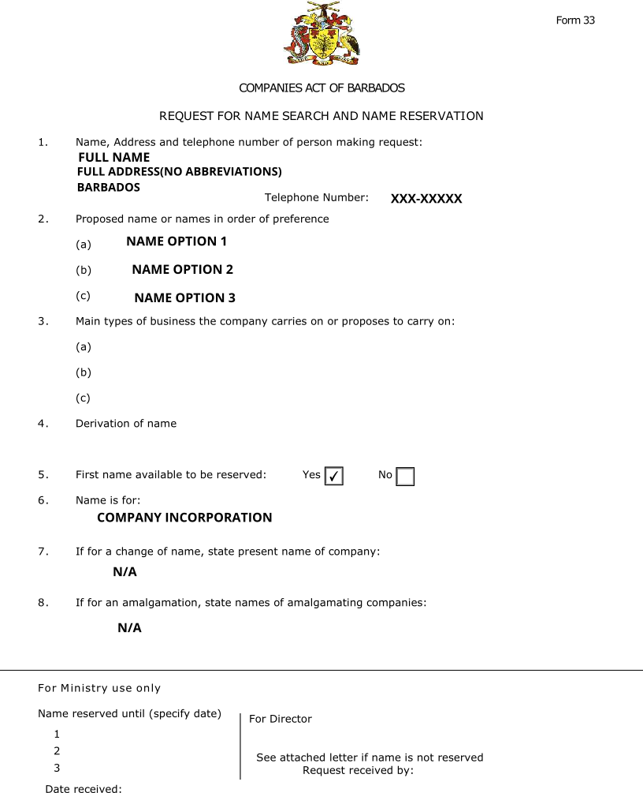
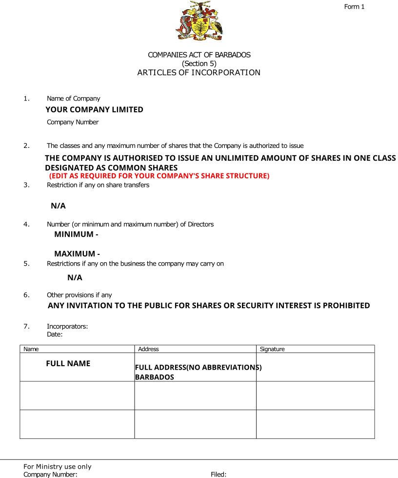
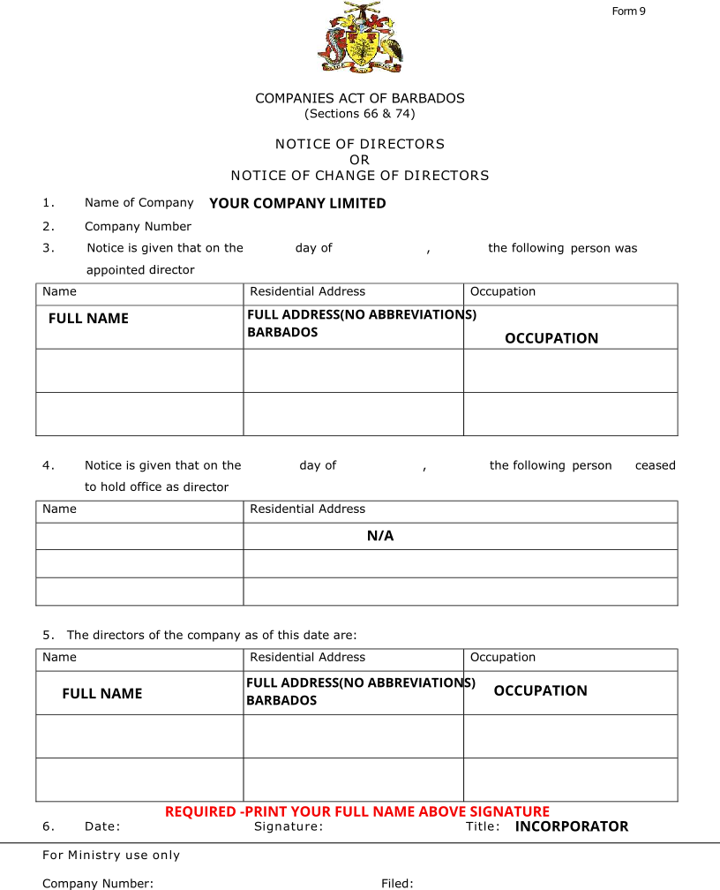

```{r setup, include=FALSE}
options(htmltools.dir.version = FALSE)
```

class: center, middle
#### Name Search & Reservation


```{r , echo=FALSE, out.width= '60%',   fig.align='centre'}

```


---
class: center, middle
#### Articles of Incorporation


```{r , echo=FALSE, out.width= '60%',   fig.align='centre'}

```


---
class: center, middle
#### Notice of Directors


```{r , echo=FALSE, out.width= '60%',   fig.align='centre'}

```


---
class: center, middle
#### Notice of Address


```{r , echo=FALSE, out.width= '60%',   fig.align='centre'}

```


